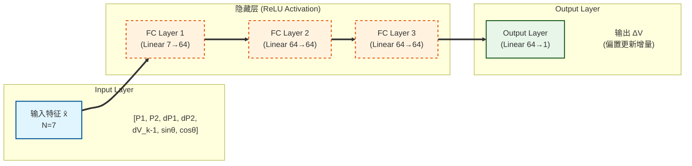

# 基于深度学习的 MZM 导频法闭环控制项目技术文档

## 1. 项目目标与约束

本项目面向 Mach–Zehnder 调制器（MZM, Mach–Zehnder Modulator）的偏置工作点控制问题。目标是在**不直接观测 DC 光功率**、且**不依赖高速 RF 可观测**的前提下，仅利用光电探测器（PD）输出中由低频导频（dither）产生的 **1f/2f 分量“功率（dBm）”**，通过学习得到的策略输出偏置电压增量 $\Delta V$，实现闭环将 MZM 偏置锁定到指定工作角度。

项目采用如下关键约束（与代码实现保持一致）：

- 可观测量：只能测得 PD 低频导频信号的 **一阶（1f）与二阶（2f）谐波**。
- 特征形式：使用 **功率幅度（dBm）**，不使用锁相后的带符号 I/Q 作为控制输入。
- 目标范围：只要求角度 $\theta$ 在 $0^\circ\sim 180^\circ$（对应半周期），即偏置电压约束在 $V\in[0,V_\pi]$。
- 控制输出：策略输出偏置电压增量 $\Delta V$，并在每次更新后执行电压限幅（clamp）以满足硬件可行区间。

对应代码入口：

- 核心仿真与导频测量：`mzm/model.py`
- 数据集生成 / 训练 / 回放：`mzm/dither_controller.py`
- Notebook 流水线入口：`mzm_dither_controller.ipynb`

---

## 2. MZM 物理模型

### 2.1 场叠加模型

以双臂 MZM 为例，输入光场为 $E_{\text{in}}$，两臂施加相位 $\phi_1,\phi_2$，并考虑有限消光比（Extinction Ratio）带来的幅度不平衡。代码采用如下形式（与 `mzm/model.py` 的实现一致）：

$$
E_{\text{out}} = E_{\text{in}}\,\sqrt{\eta}\,\frac{1}{2}\left(e^{j\phi_1} + \gamma\,e^{j\phi_2}\right)
$$

其中：

- $\eta=10^{-\mathrm{IL}/10}$ 为插入损耗（IL, dB）对应的功率衰减因子；
- $\gamma$ 为消光比相关的幅度不平衡系数。若消光比以场比定义为 $\mathrm{ER}_{\text{field}}=10^{\mathrm{ER}_{\text{dB}}/20}$，则

$$
\gamma = \frac{\mathrm{ER}_{\text{field}}-1}{\mathrm{ER}_{\text{field}}+1}.
$$

这与 `simulate_mzm()` 内部变量 gamma 的计算一致。

### 2.2 偏置电压与相位映射

代码中将电压映射到相位（以 $V_\pi$ 归一化）：

$$
\phi = \frac{\pi}{V_\pi}V.
$$

在 DC 传输（无高速 RF）部分，使用 $V_{\text{bias}}$ 对称施加到两臂：

$$
V_1=\frac{V_{\text{bias}}}{2},\quad V_2=-\frac{V_{\text{bias}}}{2}
$$

从而

$$
\phi_1=\frac{\pi}{V_{\pi,DC}}\frac{V_{\text{bias}}}{2},\quad
\phi_2=\frac{\pi}{V_{\pi,DC}}\left(-\frac{V_{\text{bias}}}{2}\right).
$$

强度（光功率）为

$$
P_{\text{out}}=|E_{\text{out}}|^2.
$$

代码中 `mzm_dc_power_mW()` 实现的就是上述 DC 传输曲线，返回单位为 mW。

### 2.3 工作点定义

为了在控制中以角度统一描述偏置点，项目定义

$$
\theta \triangleq \frac{\pi}{V_{\pi,DC}}V_{\text{bias}}.
$$

这与 `mzm/model.py` 中 `bias_to_theta_rad()` 完全一致。由此：

- $\theta=0$（0°）对应偏置在强度极大点；
- $\theta=\pi/2$（90°）对应四分之一点；
- $\theta=\pi$（180°）对应强度极小点。

在本项目中，控制范围取 $\theta\in[0,\pi]$，等价于 $V_{\text{bias}}\in[0,V_{\pi,DC}]$。

---

## 3. 导频

### 3.1 导频注入

现实系统中通常通过在偏置上叠加低频正弦导频来“探测局部斜率/曲率”。本项目采用

$$
V(t)=V_{\text{bias}} + A\sin(2\pi f_dt)
$$

其中 $A$ 为导频幅度，$f_d$ 为导频频率（kHz 量级）。

在仿真中，首先由 DC 传输 $P(V)$ 得到瞬时光功率，再经 PD 变换为电流：

$$
I(t)=\mathcal{R}\,P(t)
$$

其中 $\mathcal{R}$ 为 responsivity（A/W）。代码中 `measure_pd_dither_1f2f()` 使用 `mzm_dc_power_mW()` 计算 $P(t)$，再乘以 $\mathcal{R}$ 得到 $I(t)$。

### 3.2 小信号展开与谐波来源

设 $\Delta V(t)=A\sin(\omega t)$，其中 $\omega=2\pi f_d$。对电流（或功率）关于电压做泰勒展开：

$$
I(V_{\text{bias}}+\Delta V) \approx I_0 + I'\Delta V + \frac{1}{2}I''\Delta V^2 + \cdots
$$

代入 $\Delta V=A\sin(\omega t)$ 可得：

- 一阶项产生 1f 分量：$I' A\sin(\omega t)$。
- 二阶项包含 $\sin^2(\omega t)=\frac{1}{2}(1-\cos(2\omega t))$，因此产生 DC 与 2f 分量。

因此：

- 1f 与局部斜率 $I'(V)$ 成正比（带符号）；
- 2f 与局部曲率 $I''(V)$ 成正比（在常见条件下符号稳定，但严格而言同样可能变化）。

本项目的关键现实约束是：我们**不使用带符号的锁相 I/Q**，而只使用幅度功率（dBm），因此会丢失方向信息（详见第 5 章）。

### 3.3 锁相检测（lock-in）

对于采样信号 $x[n]$（对应 $I(t)-\overline{I}$ 的交流分量），以导频频率为参考，构造正交参考：

$$
\sin(n\Omega),\quad \cos(n\Omega),\quad \Omega=2\pi\frac{f_d}{F_s}.
$$

代码 `lockin_harmonics()` 对第 $k$ 阶谐波（$k=1,2$）提取：

$$
I_k = \frac{2}{N}\sum_{n=0}^{N-1} x[n]\sin(k\Omega n),\quad
Q_k = \frac{2}{N}\sum_{n=0}^{N-1} x[n]\cos(k\Omega n)
$$

幅度为

$$
A_k = \sqrt{I_k^2+Q_k^2}.
$$

这种归一化使得若 $x(t)=a\sin(2\pi f_dt)$，则估计得到 $I_1\approx a$。

`measure_pd_dither_1f2f()` 内部使用：

- 先计算 $I_{\text{pd}}(t)$，减去均值得到 $I_{\text{ac}}$；
- 再对 $I_{\text{ac}}$ 进行 lock-in 提取 1f 与 2f。

### 3.4 电流幅度转换为功率与 dBm

对负载电阻 $R$，若电流为纯正弦

$$
 i(t)=A\sin(\omega t)
$$

则电阻上的平均功率为

$$
P_{\text{avg}} = \frac{1}{T}\int_0^T i^2(t)R\,dt = \frac{A^2}{2}R.
$$

代码 `measure_pd_dither_1f2f()` 使用该公式将 $A_1,A_2$ 转换为 $P_1,P_2$：

- `p1_W = 0.5 * h1_A**2 * R_load`
- `p2_W = 0.5 * h2_A**2 * R_load`

并进一步转换为 dBm：

$$
P_{\text{dBm}} = 10\log_{10}(P_{\text{W}}\cdot 1000).
$$

函数返回字段包含：

- `h1_A, h2_A`：电流幅度（A）
- `p1_W, p2_W`：功率（W）
- `p1_dBm, p2_dBm`：功率（dBm）

---

## 4. 闭环控制问题表述

### 4.1 状态、观测与控制量

- 真正需要控制的状态：偏置电压 $V$（或等价的工作角度 $\theta$）。
- 可观测量：$P_1^{\text{dBm}},P_2^{\text{dBm}}$（由 PD 导频 1f/2f 提取）。
- 控制量：每步更新 $\Delta V$，并执行

$$
V_{k+1}=\mathrm{clip}(V_k+\Delta V_k,\ 0,\ V_\pi).
$$

该限幅策略与 `mzm/dither_controller.py` 的 `rollout_dbm_hist()` 实现一致。

### 4.2 目标角度的编码

目标角度 $\theta^*$ 在本项目中限定于 $[0,\pi]$。为了避免角度直接回归带来的不连续性，策略输入中对目标角度使用正余弦编码：

$$
t_1=\sin(\theta^*),\quad t_2=\cos(\theta^*).
$$

代码 `_target_encoding()` 正是该实现。

### 4.3 误差定义与 wrap

为了使误差在 $[-\pi,\pi)$ 内连续，定义

$$
 e_\theta = \mathrm{wrap}(\theta^*-\theta).
$$

代码 `wrap_to_pi()` 实现：

$$
\mathrm{wrap}(x)=(x+\pi)\bmod 2\pi-\pi.
$$

尽管目标范围仅为 $0\sim\pi$，在迭代更新过程中误差仍可能跨越边界，因此 wrap 是必要的。

---

## 5. 仅保留幅度带来的可观测性问题与解决策略

### 5.1 丢失符号信息

对 1f 分量而言，理想小信号近似下有

$$
I_{1f}\propto I'(V)\,A.
$$

其中 $I'(V)$ 在四分之一点两侧符号相反。然而如果只保留幅度 $A_1=\sqrt{I_1^2+Q_1^2}$，或进一步保留功率 $P_1\propto A_1^2$，则

$$
A_1\ge 0
$$

符号被消除，导致仅靠当前时刻 $(P_1,P_2)$ 不能确定“该向哪个方向调偏置”。

### 5.2 使用差分信息恢复方向信息

本项目采用“历史一致”的差分方式恢复方向信息：若控制器在上一拍输出了 $\Delta V_{k-1}$，那么当前观测与上一观测之间的差分

$$
\Delta P_{1,k} = P_{1,k}-P_{1,k-1},\quad
\Delta P_{2,k} = P_{2,k}-P_{2,k-1}
$$

在统计意义上携带了局部梯度方向信息（结合已知的上一拍动作方向 $\Delta V_{k-1}$）。

因此策略的输入向量定义为（与 `mzm/dither_controller.py` 完全一致）：

$$
\mathbf{x}_k=[P_{1,k}^{\text{dBm}},\ P_{2,k}^{\text{dBm}},\ \Delta P_{1,k}^{\text{dBm}},\ \Delta P_{2,k}^{\text{dBm}},\ \Delta V_{k-1},\ \sin\theta^*,\ \cos\theta^*].
$$

输入维度为 7。

---

## 6. 学习策略（Policy）与监督信号（Teacher）

### 6.1 网络结构

策略网络 **DeltaVPolicyNet** 是一个多层感知机（MLP），形式为

$$
\Delta V = \pi_\psi(\hat{\mathbf{x}})
$$

其中 $\hat{\mathbf{x}}$ 是标准化后的输入。实现要点：

- 输入维度：7
- 隐藏层：默认 64
- 深度：默认 3（每层 Linear+ReLU）
- 输出：1 维标量（电压增量）

实现位置：`mzm/dither_controller.py` 中的 `DeltaVPolicyNet`。

为便于直观理解，下面给出 **默认超参数**（in_dim=7，hidden=64，depth=3）时的多层感知机结构图。该结构与代码中 `nn.Sequential`(Linear+ReLU 重复 depth 次，再接 Linear 输出层) 一致。



补充说明：

- `depth` 表示隐藏层（Linear+ReLU）的重复次数；当 `depth` 改变时，上图中隐藏层的层数随之变化，但每层的宽度由 `hidden` 决定。
- 输出层不使用激活函数，直接回归一个标量增量 $\Delta V$。

### 6.2 归一化

为了改善训练稳定性，对输入特征做标准化：

$$
\hat{\mathbf{x}} = \frac{\mathbf{x}-\mu}{\sigma}
$$

其中 $(\mu,\sigma)$ 由训练集统计得到并随模型一起保存。

代码中 `generate_dataset_dbm_hist()` 返回 `mu` 与 `sigma`，`save_model()` 将其写入 `checkpoint`。

### 6.3 监督标签（Teacher）构造：相位误差的比例控制

本项目以一个“可解释的教师控制律”生成监督标签。首先由当前偏置得到当前角度

$$
\theta_k = \frac{\pi}{V_\pi}V_k.
$$

再计算 wrapped 相位误差

$$
 e_k = \mathrm{wrap}(\theta^* - \theta_k).
$$

将角度误差映射为电压误差：由于 $\theta=\frac{\pi}{V_\pi}V$，可得

$$
\Delta V_{\text{ideal}} = \frac{V_\pi}{\pi}e_k.
$$

于是教师标签取为

$$
 y_k = \mathrm{clip}(g\,\Delta V_{\text{ideal}},\ -\Delta V_{\max},\ \Delta V_{\max}),
$$

其中 $g$ 为 `teacher_gain`，$\Delta V_{\max}$ 为每步最大电压步长。代码中：

- `teacher_gain` 默认 0.5
- `max_step_V` 默认 0.2

该教师并未使用导频观测，只用“隐藏真值角度”产生监督信号；训练后的网络学习到从可观测特征近似该控制律。

---

## 7. 数据集生成：如何模拟“真实可用历史”

`generate_dataset_dbm_hist()` 为每个样本构造一个“当前时刻 + 上一时刻”的观测对，使差分特征具备现实意义。

本节重点解释：

- `dp1/dp2`、`dV_{k-1}` 与目标角度 $\theta^*$ 这类“涉及上一拍/目标”的量在数据集生成阶段如何构造；
- 为什么这种构造方式在物理上是自洽的（即：它对应一段在闭环系统中可能发生的历史）。

对每个样本：

1. 随机采样当前偏置 $V_k\sim\mathcal{U}(0,V_\pi)$。
2. 随机采样目标角度 $\theta^*\sim\mathcal{U}(0,\pi)$（0–180°）。
3. 随机采样上一拍动作 $\Delta V_{k-1}\sim\mathcal{U}(-\Delta V_{\max},\Delta V_{\max})$。
4. 根据 $V_{k-1}=\mathrm{clip}(V_k-\Delta V_{k-1},0,V_\pi)$ 反推上一拍偏置。
5. 分别在 $V_{k-1}$ 与 $V_k$ 下调用 `measure_pd_dither_1f2f()` 得到 `p1_dBm/p2_dBm`。
6. 构造差分特征 $dp1,dp2$。
7. 将目标角度编码为 $(\sin\theta^*,\cos\theta^*)$，拼接得到 7 维输入特征。

该流程确保差分来源于“可实现的历史”，而不是额外施加的探测动作。

### 7.1 关键变量的含义与构造方式

#### 7.1.1 上一拍动作 $\Delta V_{k-1}$（特征 `dV_{k-1}`）

在真实闭环中，控制器每一拍会输出一个更新量 $\Delta V$。为了让模型在训练时能够学习“方向信息”，本项目把上一拍动作 $\Delta V_{k-1}$ 作为输入特征之一。

在数据集生成阶段，$\Delta V_{k-1}$ **并不来自已训练策略**，而是用一个有界分布直接采样：

$$
\Delta V_{k-1} \sim \mathcal{U}(-\Delta V_{\max},\ \Delta V_{\max}).
$$

其中 $\Delta V_{\max}$ 与代码中 `max_step_V` 一致（默认 0.2 V）。这一步的目的并不是模拟某个特定控制器，而是让训练样本覆盖“上一拍可能采取的动作方向与大小”，从而在仅幅度观测（dBm）下仍能恢复方向。

#### 7.1.2 上一拍偏置 $V_{k-1}$ 的反推

真实系统的演化关系为 $V_k=\mathrm{clip}(V_{k-1}+\Delta V_{k-1})$。为了构造一段物理上自洽的历史，本项目反向构造：

$$
V_{k-1}=\mathrm{clip}(V_k-\Delta V_{k-1},\ 0,\ V_\pi).
$$

这样得到的 $(V_{k-1},\Delta V_{k-1},V_k)$ 满足“上一拍动作确实可能把偏置从 $V_{k-1}$ 推到 $V_k$”这一约束。

#### 7.1.3 差分特征 $dp1,dp2$ 的来源

导频测量函数 `measure_pd_dither_1f2f()` 返回 1f/2f 的功率幅度（dBm）：

$$
P_{1,k}^{\mathrm{dBm}},\ P_{2,k}^{\mathrm{dBm}}.
$$

差分特征按两拍观测差分定义：

$$
dp1 = P_{1,k}^{\mathrm{dBm}}-P_{1,k-1}^{\mathrm{dBm}},\quad
dp2 = P_{2,k}^{\mathrm{dBm}}-P_{2,k-1}^{\mathrm{dBm}}.
$$

代码实现中，$P_{1,k-1}^{\mathrm{dBm}},P_{2,k-1}^{\mathrm{dBm}}$ 来自对 $V_{k-1}$ 的一次测量，$P_{1,k}^{\mathrm{dBm}},P_{2,k}^{\mathrm{dBm}}$ 来自对 $V_k$ 的一次测量，因此差分对应“系统经历上一拍动作后观测发生的变化”。

#### 7.1.4 目标角度 $\theta^*$ 的编码

目标角度在训练集中独立采样：

$$
	heta^*\sim\mathcal{U}(0,\pi).
$$

并编码成输入特征的最后两维：

$$
t_1=\sin\theta^*,\quad t_2=\cos\theta^*.
$$

### 7.2 输入特征与标签的最终形式（与实现一致）

对每个样本，拼接得到 7 维输入：

$$
\mathbf{x}_k=[P_{1,k}^{\text{dBm}},\ P_{2,k}^{\text{dBm}},\ dp1,\ dp2,\ \Delta V_{k-1},\ \sin\theta^*,\ \cos\theta^*].
$$

监督标签 $y$（教师输出）为当前拍建议的更新量 $\Delta V_k$（见第 6.3 节）。

### 7.3 归一化与保存字段

生成原始特征矩阵 $X$ 后，按每一维统计均值与标准差：

$$
\mu=\mathbb{E}[X],\quad \sigma=\sqrt{\mathbb{E}[(X-\mu)^2]}.
$$

并得到归一化特征：

$$
X_n=\frac{X-\mu}{\sigma}.
$$

数据集工件（NPZ）保存的字段与含义如下：

- `Xn`：归一化特征，形状 $(N,7)$
- `y`：标签，形状 $(N,1)$
- `mu, sigma`：归一化统计，形状 $(7,)$
- `device_params`：器件参数字典（`Vpi/ER/IL/Pin/Responsivity/R_load`）
- `dither_params`：导频参数字典（`V_dither_amp/f_dither/Fs/n_periods`）
- `teacher_gain, max_step_V`：教师超参数

说明：当前实现默认不把隐藏变量（例如 $V_k, V_{k-1}, \theta^*$）逐样本保存到 NPZ；若需要做更细致的离线分析，可扩展保存（这不影响训练逻辑）。

数据集工件：

- `artifacts/dither_dataset_dbm_hist.npz`

包含字段：

- `Xn`：归一化后的特征
- `y`：监督标签（teacher 输出的 $\Delta V$）
- `mu, sigma`：归一化统计
- 以及 `device/dither` 参数与 `teacher` 超参数

---

## 8. 训练与保存：可复用的模型工件

### 8.1 训练目标

训练采用均方误差（MSE）：

$$
\min_\psi\ \mathbb{E}\left[\left(\pi_\psi(\hat{\mathbf{x}})-y\right)^2\right].
$$

实现位置：`train_policy()`。

### 8.1.1 训练数据与批处理

训练直接使用 NPZ 中的 `Xn` 与 `y`：

- `Xn` 已完成归一化，因此训练时不再重复做标准化。
- 训练使用 DataLoader 按批次打乱迭代。

### 8.1.2 默认超参数（可在脚本中修改）

`train_policy()` 默认值：

- `epochs=2000`
- `batch=256`
- `lr=1e-3`（Adam）
- 网络结构：`hidden=64`, `depth=3`

这些值在本项目中属于工程默认配置，用于在仿真数据上得到稳定可复现的收敛表现。

### 8.2 模型保存格式

模型保存路径：

- `artifacts/dither_policy_dbm_hist.pt`

保存内容包括：

- `model_state`：网络参数
- `mu, sigma`：输入归一化统计
- `device_params, dither_params`：仿真/测量参数

补充说明：

- 推理时必须使用与训练相同的 `mu, sigma` 对输入特征做标准化，否则网络输出尺度将失真。
- `device_params, dither_params` 被随模型保存，便于在推理或回放时避免参数不一致。

---

## 9. 闭环回放（rollout）：验证收敛性

`rollout_dbm_hist()` 实现一个离线闭环仿真回放：

- 给定目标角度（度）`theta_target_deg` 与初始偏置 `V_init`；
- 迭代 steps 次：
  1) 在当前偏置下测量 `p1_dBm/p2_dBm`；
  2) 与历史构造 `dp1/dp2`，并带入上一拍 `prev_dv`；
  3) 归一化后输入策略网络得到 `dv`；
  4) 更新偏置并限幅；
  5) 计算 wrapped 角度误差并记录。

输出：

- `V`：偏置轨迹
- `err_deg`：wrapped 相位误差（度）

### 9.1 单步更新的“状态—观测—动作”闭环

回放过程可以用以下变量描述：

- 状态：$V_k$（偏置电压，限制在 $[0,V_\pi]$）
- 观测：$(P_{1,k}^{\mathrm{dBm}},P_{2,k}^{\mathrm{dBm}})$（由导频测量得到）
- 历史：上一拍观测 $(P_{1,k-1}^{\mathrm{dBm}},P_{2,k-1}^{\mathrm{dBm}})$ 与上一拍动作 $\Delta V_{k-1}$
- 动作：$\Delta V_k$（策略网络输出）

每一拍的更新（与实现一致）可写为：

1) 测量：$P_{1,k}^{\mathrm{dBm}},P_{2,k}^{\mathrm{dBm}} \leftarrow \text{measure}(V_k)$

2) 构造差分：

$$
dp1_k=P_{1,k}^{\mathrm{dBm}}-P_{1,k-1}^{\mathrm{dBm}},\quad
dp2_k=P_{2,k}^{\mathrm{dBm}}-P_{2,k-1}^{\mathrm{dBm}}
$$

3) 组装并标准化输入：

$$
\hat{\mathbf{x}}_k = \frac{[P_{1,k}^{\mathrm{dBm}},P_{2,k}^{\mathrm{dBm}},dp1_k,dp2_k,\Delta V_{k-1},\sin\theta^*,\cos\theta^*]-\mu}{\sigma}
$$

4) 策略输出与限幅：

$$
\Delta V_k = \pi_\psi(\hat{\mathbf{x}}_k),\quad
V_{k+1}=\mathrm{clip}(V_k+\Delta V_k,0,V_\pi)
$$

5) 误差记录：$e_k=\mathrm{wrap}(\theta^*-\theta(V_k))$。

### 9.2 回放返回的 trace 字段（用于逐轮展示）

为支持逐轮过程打印与调试，当前实现除 `V/err_deg` 外，还返回：

- `dv`：每轮策略输出的 $\Delta V_k$
- `p1_dBm, p2_dBm`：每轮观测到的导频 1f/2f 功率（dBm）
- `dp1_dBm, dp2_dBm`：每轮观测差分
- `theta_deg`：每轮偏置对应的角度（度）

Notebook 入口 `mzm_dither_controller.ipynb` 默认以“单目标角度”方式运行，并打印上述 trace 以便审阅每轮推理过程。

---

## 10. 代码结构与快速上手（严格步骤）

### 10.1 推荐入口：Notebook

打开并依次运行：

- mzm_dither_controller.ipynb

其结构已按“数据集生成 → 训练 → 推理/回放”拆分，并把工件写入 artifacts/ 以便复用。

### 10.2 脚本入口：一键生成/训练/回放

在仓库根目录运行：

```bash
python scripts/train_mzm_dither_controller.py
```

脚本会：

1) 若数据集不存在则生成；
2) 训练模型并保存；
3) 对多个目标角做一次 rollout 打印最终误差。

### 10.3 依赖

requirements.txt 包含最小依赖：

- numpy
- matplotlib
- torch

---

## 11. 参数与单位核对（与实现一致）

- `Vpi_DC`：伏特（V），默认 5.0
- `V_dither_amp`：伏特（V），默认 0.05
- `f_dither`：赫兹（Hz），默认 10 kHz
- `Fs`：采样率（Hz），默认 2 MHz
- `n_periods`：采样周期数，默认 120
- `R_load`：欧姆（Ω），默认 50
- `Responsivity`：A/W，默认 0.786
- `p1_dBm`/`p2_dBm`：dBm，按 $P_{\text{avg}}=(A^2/2)R$ 计算

---

## 12. 局限性

1. **角度与电压的映射依赖 Vpi**：若硬件 Vpi 漂移或与仿真不一致，控制效果会退化，需要做参数辨识或在线自适应。
2. **限幅会引入非线性**：靠近边界时，策略输出会被 clip 截断，误差收敛特性会改变，应在评估中明确区分“内点行为”和“边界行为”。

---

## 13. 与源代码的对应关系（便于查阅）

- `mzm/model.py`
  - `mzm_dc_power_mW()`：DC 传输曲线（用于导频仿真）
  - `lockin_harmonics()`：锁相提取 1f/2f 的 I/Q/幅度
  - `measure_pd_dither_1f2f()`：导频测量主函数，返回 p1_dBm/p2_dBm 等
  - `bias_to_theta_rad()`, `theta_to_bias_V()`, `wrap_to_pi()`：角度/电压映射与 wrap

- `mzm/dither_controller.py`
  - `generate_dataset_dbm_hist()`：数据集生成（dbm_hist 特征）
  - `train_policy()`：训练
  - `save_dataset()/load_dataset()`：数据集工件
  - `save_model()`/`load_model()`：模型工件
  - `rollout_dbm_hist()`：闭环回放

- `mzm_dither_controller.ipynb`
  - 将上述函数组织为可复用流水线
