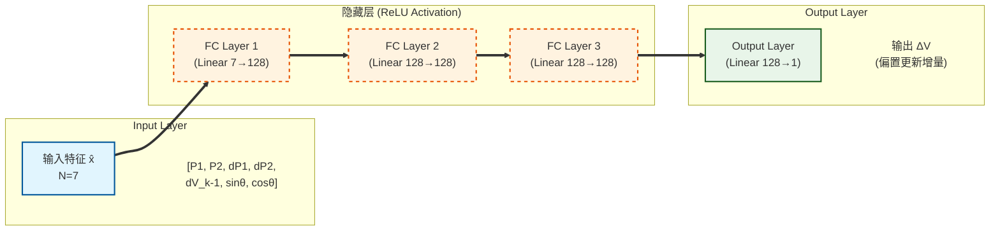

# 基于深度学习的 MZM 导频法闭环控制项目技术文档

## 1. 项目目标与约束

本项目面向 Mach–Zehnder 调制器（MZM, Mach–Zehnder Modulator）的偏置工作点控制问题。目标是在**不直接观测 DC 光功率**、且**不依赖高速 RF 可观测**的前提下，仅利用光电探测器（PD）输出中由低频导频（dither）产生的 **1f/2f 分量“功率（dBm）”**，通过学习得到的策略输出偏置电压增量 $\Delta V$，实现闭环将 MZM 偏置锁定到指定工作角度。

项目采用如下关键约束（与代码实现保持一致）：

- 可观测量：只能测得 PD 低频导频信号的 **一阶（1f）与二阶（2f）谐波**。
- 特征形式：使用 **DC 归一化的电流幅度 (H/Idc)**，不使用锁相后的带符号 I/Q，也不使用 Power dBm（以消除光功率波动影响）。
- 目标范围：只要求角度 $\theta$ 在 $0^\circ\sim 180^\circ$（对应半周期），即偏置电压约束在 $V\in[0,V_\pi]$。
- 控制输出：策略输出偏置电压增量 $\Delta V$，并在每次更新后执行电压限幅（clamp）以满足硬件可行区间。

补充（鲁棒性评估设定）：

- 控制器**不需要观测高速 RF**，但在仿真评估/数据集生成时，可选择在偏置上叠加高速 RF 正弦项作为“外部干扰”，用于测试策略在 RF 调制存在时的鲁棒性。
- RF 干扰鲁棒性测试中，**导频（dither）的幅度与频率必须保持不变**；鲁棒性来自策略与特征的设计，而不是通过改变导频注入来“适配”环境。

对应代码入口：

- 核心仿真与导频测量：`mzm/model.py`
- 数据集生成 / 训练 / 回放：`mzm/dither_controller.py`
- Notebook 流水线入口：`mzm_dither_controller.ipynb`

补充：数据集生成支持可选 GPU 加速（torch）。

实现说明（torch 加速路径）：
- 目前导频测量/lock-in 的**核心计算已统一为 torch 批量实现**，因此
  - `generate_dataset_dbm_hist(..., accel='auto')`：CUDA 可用则走 GPU，否则自动使用 torch-on-CPU。
  - `rollout_dbm_hist(..., accel='auto')`：同样支持 CUDA/CPU 自动选择。
- `torch_batch`：控制每次送入设备（通常是 GPU）的 bias 数量，显存不足时可调小。
- PyTorch 在 CUDA 下会使用 caching allocator：即使张量已释放，`nvidia-smi` 可能仍显示占用显存（正常现象）。如需归还缓存给系统可手动调用 `torch.cuda.empty_cache()`。

---

## 2. MZM 物理模型

### 2.1 场叠加模型

以双臂 MZM 为例，输入光场为 $E_{\text{in}}$，两臂施加相位 $\phi_1,\phi_2$，并考虑有限消光比（Extinction Ratio）带来的幅度不平衡。代码采用如下形式（与 `mzm/model.py` 的实现一致）：

$$
E_{\text{out}} = E_{\text{in}}\,\sqrt{\eta}\,\frac{1}{2}\left(e^{j\phi_1} + \gamma\,e^{j\phi_2}\right)
$$

其中：

- $\eta=10^{-\mathrm{IL}/10}$ 为插入损耗（IL, dB）对应的功率衰减因子；
- $\gamma$ 为消光比相关的幅度不平衡系数。若消光比以场比定义为 $\mathrm{ER}_{\text{field}}=10^{\mathrm{ER}_{\text{dB}}/20}$，则

$$
\gamma = \frac{\mathrm{ER}_{\text{field}}-1}{\mathrm{ER}_{\text{field}}+1}.
$$

这与 `simulate_mzm()` 内部变量 gamma 的计算一致。

### 2.2 偏置电压与相位映射

代码中将电压映射到相位（以 $V_\pi$ 归一化）：

$$
\phi = \frac{\pi}{V_\pi}V.
$$

在 DC 传输（无高速 RF）部分，使用 $V_{\text{bias}}$ 对称施加到两臂：

$$
V_1=\frac{V_{\text{bias}}}{2},\quad V_2=-\frac{V_{\text{bias}}}{2}
$$

从而

$$
\phi_1=\frac{\pi}{V_{\pi,DC}}\frac{V_{\text{bias}}}{2},\quad
\phi_2=\frac{\pi}{V_{\pi,DC}}\left(-\frac{V_{\text{bias}}}{2}\right).
$$

强度（光功率）为

$$
P_{\text{out}}=|E_{\text{out}}|^2.
$$

代码中 `mzm_dc_power_mW()` 实现的就是上述 DC 传输曲线，返回单位为 mW。

### 2.3 工作点定义

为了在控制中以角度统一描述偏置点，项目定义

$$
\theta \triangleq \frac{\pi}{V_{\pi,DC}}V_{\text{bias}}.
$$

这与 `mzm/model.py` 中 `bias_to_theta_rad()` 完全一致。由此：

- $\theta=0$（0°）对应偏置在强度极大点；
- $\theta=\pi/2$（90°）对应四分之一点；
- $\theta=\pi$（180°）对应强度极小点。

在本项目中，控制范围取 $\theta\in[0,\pi]$，等价于 $V_{\text{bias}}\in[0,V_{\pi,DC}]$。

---

## 3. 导频

### 3.1 导频注入

现实系统中通常通过在偏置上叠加低频正弦导频来“探测局部斜率/曲率”。本项目采用

$$
V(t)=V_{\text{bias}} + A\sin(2\pi f_dt)
$$

其中 $A$ 为导频幅度，$f_d$ 为导频频率（kHz 量级）。

在仿真中，首先由 DC 传输 $P(V)$ 得到瞬时光功率，再经 PD 变换为电流：

$$
I(t)=\mathcal{R}\,P(t)
$$

其中 $\mathcal{R}$ 为 responsivity（A/W）。代码中 `measure_pd_dither_1f2f()` 使用 `mzm_dc_power_mW()` 计算 $P(t)$，再乘以 $\mathcal{R}$ 得到 $I(t)$。

补充：为支持 GPU/批量加速，当前实现中 `measure_pd_dither_1f2f()` 的底层计算已切换为 torch 批量核心（数值模型与上述推导等价），并保持其返回字段不变。

### 3.2 小信号展开与谐波来源

设 $\Delta V(t)=A\sin(\omega t)$，其中 $\omega=2\pi f_d$。对电流（或功率）关于电压做泰勒展开：

$$
I(V_{\text{bias}}+\Delta V) \approx I_0 + I'\Delta V + \frac{1}{2}I''\Delta V^2 + \cdots
$$

代入 $\Delta V=A\sin(\omega t)$ 可得：

- 一阶项产生 1f 分量：$I' A\sin(\omega t)$。
- 二阶项包含 $\sin^2(\omega t)=\frac{1}{2}(1-\cos(2\omega t))$，因此产生 DC 与 2f 分量。

因此：

- 1f 与局部斜率 $I'(V)$ 成正比（带符号）；
- 2f 与局部曲率 $I''(V)$ 成正比（在常见条件下符号稳定，但严格而言同样可能变化）。

本项目的关键现实约束是：我们**不使用带符号的锁相 I/Q**，而只使用幅度功率（dBm），因此会丢失方向信息（详见第 5 章）。

### 3.3 锁相检测（lock-in）

对于采样信号 $x[n]$（对应 $I(t)-\overline{I}$ 的交流分量），以导频频率为参考，构造正交参考：

$$
\sin(n\Omega),\quad \cos(n\Omega),\quad \Omega=2\pi\frac{f_d}{F_s}.
$$

代码 `lockin_harmonics()` 给出了一个 NumPy 版本的锁相提取（便于对照推导/调试）。实际训练/数据集/回放默认使用 torch 批量核心在 CPU 或 GPU 上按同样公式计算。

`lockin_harmonics()` 对第 $k$ 阶谐波（$k=1,2$）提取：

$$
I_k = \frac{2}{N}\sum_{n=0}^{N-1} x[n]\sin(k\Omega n),\quad
Q_k = \frac{2}{N}\sum_{n=0}^{N-1} x[n]\cos(k\Omega n)
$$

幅度为

$$
A_k = \sqrt{I_k^2+Q_k^2}.
$$

这种归一化使得若 $x(t)=a\sin(2\pi f_dt)$，则估计得到 $I_1\approx a$。

`measure_pd_dither_1f2f()` / torch 批量核心的计算逻辑一致：
- 先计算 $I_{\text{pd}}(t)$，减去均值得到 $I_{\text{ac}}$；
- 再对 $I_{\text{ac}}$ 进行 lock-in 提取 1f 与 2f。

### 3.4 电流幅度转换为功率与 dBm

对负载电阻 $R$，若电流为纯正弦

$$
 i(t)=A\sin(\omega t)
$$

则电阻上的平均功率为

$$
P_{\text{avg}} = \frac{1}{T}\int_0^T i^2(t)R\,dt = \frac{A^2}{2}R.
$$

代码 `measure_pd_dither_1f2f()` 使用该公式将 $A_1,A_2$ 转换为 $P_1,P_2$：

- `p1_W = 0.5 * h1_A**2 * R_load`
- `p2_W = 0.5 * h2_A**2 * R_load`

并进一步转换为 dBm：

$$
P_{\text{dBm}} = 10\log_{10}(P_{\text{W}}\cdot 1000).
$$

函数返回字段包含：

- `h1_A, h2_A`：电流幅度（A）
- `p1_W, p2_W`：功率（W）
- `p1_dBm, p2_dBm`：功率（dBm）

### 3.5 $H_1, H_2$ 的严格定义公式

为了消除歧义，本项目中 $H_1, H_2$ 指的是 **PD 输出电流中相应频率分量的“幅度（Magnitude）”**，单位为安培（A）。

其计算公式完全基于上述数字锁相逻辑：

$$
H_k \triangleq \sqrt{I_k^2 + Q_k^2}
$$

其中 $I_k, Q_k$ 为第 $k$ 阶谐波的同相与正交分量积分值：

$$
I_k = \frac{2}{N}\sum_{n=0}^{N-1} (I[n]-I_{DC})\sin(k\Omega n),\quad
Q_k = \frac{2}{N}\sum_{n=0}^{N-1} (I[n]-I_{DC})\cos(k\Omega n)
$$

其中 $I_{DC}$ 定义为采样窗口内 PD 光电流的**时间平均值**（即直流分量）：

$$
I_{DC} \triangleq \frac{1}{N}\sum_{n=0}^{N-1} I[n]
$$

**归一化特征**则定义为：

$$
\tilde{H}_k \triangleq \frac{H_k}{I_{DC}}
$$

这是送入神经网络的实际物理量（无量纲）。

### 3.6 噪声与噪底（代码实现路径）

本仓库中“噪声/噪底”的实现分两条路径：

1) **频谱演示路径（`simulate_mzm()`）**：用于生成带噪底的 PD 输出电谱（便于对照频谱仪/FFT 单次谱观测），会显式计算并注入噪声功率。

2) **控制器观测路径（`measure_pd_dither_*()` / lock-in）**：用于生成控制器输入特征 $\tilde{H}_1,\tilde{H}_2$。当前实现为**理想 lock-in 提取**（不注入 thermal/shot/RIN 的随机噪声），因此训练/回放中的 dither 特征不会随噪底起伏。

为避免歧义，下述公式与术语以 `mzm/model.py` 的实现为准。

#### 3.6.1 噪声功率的计算：按 RBW 积分

在 `simulate_mzm()` 中，首先得到平均光电流 $I_{\text{av}}$，然后计算三类噪声在分辨率带宽 $\mathrm{RBW}$ 内对应的**等效噪声功率**（单位 W）：

- **热噪声（Johnson-Nyquist）**：
  $$P_{\text{thermal}} = kT\cdot \mathrm{RBW}$$
- **散粒子噪声（Shot）**：
  $$P_{\text{shot}} = (2q I_{\text{av}})\cdot R_{\text{load}}\cdot \mathrm{RBW}$$
- **相对强度噪声（RIN）**（其中 $\mathrm{RIN}_{\text{lin}}=10^{\mathrm{RIN}_{\text{dB/Hz}}/10}$）：
  $$P_{\text{rin}} = \mathrm{RIN}_{\text{lin}}\cdot I_{\text{av}}^2\cdot R_{\text{load}}\cdot \mathrm{RBW}$$

总噪声功率为：
$$P_{\text{noise}} = P_{\text{thermal}} + P_{\text{shot}} + P_{\text{rin}}.$$

同时给出噪声功率谱密度（dBm/Hz）：
$$P_{\text{density}}=\frac{P_{\text{noise}}}{\mathrm{RBW}}.$$

#### 3.6.2 噪底如何“进入频谱”：对每个 FFT bin 叠加随机噪声功率

`simulate_mzm()` 并不是在时域电流 $I_{PD}(t)$ 上叠加高斯噪声，而是在计算电谱后对每个频点（FFT bin）生成一份随机噪声功率并相加：

- 先由 FFT 得到每个频点的信号功率 $P_{\text{sig}}[k]$（单位 W）。
- 再生成随机噪声功率 $P_{\text{n}}[k]$，其均值为 $P_{\text{noise}}$，用于模拟单次频谱观测的起伏。
- 最终频点功率：
  $$P_{\text{total}}[k]=P_{\text{sig}}[k]+P_{\text{n}}[k].$$

绘图函数 `plot_electrical_spectrum()` 里画出的“噪底虚线”来自：
$$P_{\text{floor,dBm}} = P_{\text{density,dBm/Hz}} + 10\log_{10}(\mathrm{RBW}).$$

#### 3.6.3 与控制器输入的关系（重要）

控制器输入特征 $\tilde{H}_1,\tilde{H}_2$ 来自 dither 的 lock-in 幅度提取（`_measure_pd_dither_1f2f_batch_torch()` 及其包装函数）。这条路径目前不包含 thermal/shot/RIN 的随机噪声注入。

因此：
- 文档中涉及“噪底/噪声功率/噪声谱密度”的描述，默认指**频谱演示**（`simulate_mzm()`）口径；
- 若要评估“导频观测在噪声下的鲁棒性”，需要后续在时域或 lock-in 输出端加入等效噪声（例如按 $2qI$、RIN 与 $kT$ 推导输出方差）。

---

## 4. 闭环控制问题表述

### 4.1 状态、观测与控制量

- 真正需要控制的状态：偏置电压 $V$（或等价的工作角度 $\theta$）。
- 可观测量：$H_1, H_2$ 的归一化幅度（由 PD 导频 1f/2f 提取并除以 DC）。
- 控制量：每步更新 $\Delta V$，并执行

$$
V_{k+1}=\mathrm{clip}(V_k+\Delta V_k,\ 0,\ V_\pi).
$$

该限幅策略与 `mzm/dither_controller.py` 的 `rollout_dbm_hist()` 实现一致（注：函数名保留了 `dbm` 是为了兼容旧版命名，实际内部已切换为 `normalized` 特征）。

### 4.2 目标角度的编码

目标角度 $\theta^*$ 在本项目中限定于 $[0,\pi]$。为了避免角度直接回归带来的不连续性，策略输入中对目标角度使用正余弦编码：

$$
t_1=\sin(\theta^*),\quad t_2=\cos(\theta^*).
$$

代码 `_target_encoding()` 正是该实现。

### 4.3 误差定义与 wrap

为了使误差在 $[-\pi,\pi)$ 内连续，定义

$$
 e_\theta = \mathrm{wrap}(\theta^*-\theta).
$$

代码 `wrap_to_pi()` 实现：

$$
\mathrm{wrap}(x)=(x+\pi)\bmod 2\pi-\pi.
$$

尽管目标范围仅为 $0\sim\pi$，在迭代更新过程中误差仍可能跨越边界，因此 wrap 是必要的。

---

## 5. 仅保留幅度带来的可观测性问题与解决策略

### 5.1 丢失符号信息

对 1f 分量而言，理想小信号近似下有

$$
I_{1f}\propto I'(V)\,A.
$$

其中 $I'(V)$ 在四分之一点两侧符号相反。然而如果只保留幅度 $A_1=\sqrt{I_1^2+Q_1^2}$，或进一步保留功率 $P_1\propto A_1^2$，则

$$
A_1\ge 0
$$

符号被消除，导致仅靠当前时刻 $(H_1,H_2)$ 不能确定“该向哪个方向调偏置”。

### 5.2 使用差分信息恢复方向信息

本项目采用“历史一致”的差分方式恢复方向信息：若控制器在上一拍输出了 $\Delta V_{k-1}$，那么当前观测与上一观测之间的差分

$$
\Delta \tilde{H}_{1,k} = \tilde{H}_{1,k}-\tilde{H}_{1,k-1},\quad
\Delta \tilde{H}_{2,k} = \tilde{H}_{2,k}-\tilde{H}_{2,k-1}
$$

在统计意义上携带了局部梯度方向信息（结合已知的上一拍动作方向 $\Delta V_{k-1}$）。

因此策略的输入向量定义为（与 `mzm/dither_controller.py` 完全一致）：

$$
\mathbf{x}_k=[\tilde{H}_{1,k},\ \tilde{H}_{2,k},\ \Delta \tilde{H}_{1,k},\ \Delta \tilde{H}_{2,k},\ \Delta V_{k-1},\ \sin\theta^*,\ \cos\theta^*].
$$

其中 $\tilde{H} = H/I_{DC}$ 为归一化幅度。输入维度为 7。

---

## 6. 学习策略（Policy）与监督信号（Teacher）

### 6.1 网络结构

策略网络 **DeltaVPolicyNet** 是一个多层感知机（MLP），形式为

$$
\Delta V = \pi_\psi(\hat{\mathbf{x}})
$$

其中 $\hat{\mathbf{x}}$ 是标准化后的输入。实现要点：

- 输入维度：7
- 隐藏层：默认 128（已优化以提升极值点拟合能力）
- 深度：默认 3（每层 Linear+ReLU）
- 输出：1 维标量（电压增量）

实现位置：`mzm/dither_controller.py` 中的 `DeltaVPolicyNet`。
注：代码已更新支持动态架构参数（hidden/depth），模型保存时会自动记录这些参数，加载时自动适配。

为便于直观理解，下面给出 **优化后超参数**（in_dim=7，hidden=128，depth=3）时的多层感知机结构图。该结构与代码中 `nn.Sequential`(Linear+ReLU 重复 depth 次，再接 Linear 输出层) 一致。



补充说明：

- `depth` 表示隐藏层（Linear+ReLU）的重复次数；当 `depth` 改变时，上图中隐藏层的层数随之变化，但每层的宽度由 `hidden` 决定。
- 输出层不使用激活函数，直接回归一个标量增量 $\Delta V$。

### 6.2 归一化

为了改善训练稳定性，对输入特征做标准化：

$$
\hat{\mathbf{x}} = \frac{\mathbf{x}-\mu}{\sigma}
$$

其中 $(\mu,\sigma)$ 由训练集统计得到并随模型一起保存。

代码中 `generate_dataset_dbm_hist()` 返回 `mu` 与 `sigma`，`save_model()` 将其写入 `checkpoint`。

### 6.3 监督标签（Teacher）构造：相位误差的比例控制

本项目以一个“可解释的教师控制律”生成监督标签。首先由当前偏置得到当前角度

$$
\theta_k = \frac{\pi}{V_\pi}V_k.
$$

再计算 wrapped 相位误差

$$
 e_k = \mathrm{wrap}(\theta^* - \theta_k).
$$

将角度误差映射为电压误差：由于 $\theta=\frac{\pi}{V_\pi}V$，可得

$$
\Delta V_{\text{ideal}} = \frac{V_\pi}{\pi}e_k.
$$

于是教师标签取为

$$
 y_k = \mathrm{clip}(g\,\Delta V_{\text{ideal}},\ -\Delta V_{\max},\ \Delta V_{\max}),
$$

其中 $g$ 为 `teacher_gain`，$\Delta V_{\max}$ 为每步最大电压步长。代码中：

- `teacher_gain` 默认 0.5
- `max_step_V` 默认 0.2

该教师并未使用导频观测，只用“隐藏真值角度”产生监督信号；训练后的网络学习到从可观测特征近似该控制律。

---

## 7. 数据集生成：如何模拟“真实可用历史”

`generate_dataset_dbm_hist()` 为每个样本构造一个“当前时刻 + 上一时刻”的观测对，使差分特征具备现实意义。

本节重点解释：

- `dp1/dp2`、`dV_{k-1}` 与目标角度 $\theta^*$ 这类“涉及上一拍/目标”的量在数据集生成阶段如何构造；
- 为什么这种构造方式在物理上是自洽的（即：它对应一段在闭环系统中可能发生的历史）。

对每个样本：

1. 随机采样当前偏置 $V_k\sim\mathcal{U}(0,V_\pi)$。
2. 随机采样目标角度 $\theta^*\sim\mathcal{U}(0,\pi)$（0–180°）。
3. 随机采样上一拍动作 $\Delta V_{k-1}\sim\mathcal{U}(-\Delta V_{\max},\Delta V_{\max})$。
4. 根据 $V_{k-1}=\mathrm{clip}(V_k-\Delta V_{k-1},0,V_\pi)$ 反推上一拍偏置。
5. 分别在 $V_{k-1}$ 与 $V_k$ 下测量 `p1_dBm/p2_dBm`。
  - 实现上为提高速度，`generate_dataset_dbm_hist()` 使用 torch 批量接口（`measure_pd_dither_1f2f_dbm_batch_torch()`）一次性计算整批样本的导频特征。
6. 构造差分特征 $dp1,dp2$。
7. 将目标角度编码为 $(\sin\theta^*,\cos\theta^*)$，拼接得到 7 维输入特征。

该流程确保差分来源于“可实现的历史”，而不是额外施加的探测动作。

### 7.1 关键变量的含义与构造方式

#### 7.1.1 上一拍动作 $\Delta V_{k-1}$（特征 `dV_{k-1}`）

在真实闭环中，控制器每一拍会输出一个更新量 $\Delta V$。为了让模型在训练时能够学习“方向信息”，本项目把上一拍动作 $\Delta V_{k-1}$ 作为输入特征之一。

在数据集生成阶段，$\Delta V_{k-1}$ **并不来自已训练策略**，而是用一个有界分布直接采样：

$$
\Delta V_{k-1} \sim \mathcal{U}(-\Delta V_{\max},\ \Delta V_{\max}).
$$

其中 $\Delta V_{\max}$ 与代码中 `max_step_V` 一致（默认 0.2 V）。这一步的目的并不是模拟某个特定控制器，而是让训练样本覆盖“上一拍可能采取的动作方向与大小”，从而在仅幅度观测（dBm）下仍能恢复方向。

#### 7.1.2 上一拍偏置 $V_{k-1}$ 的反推

真实系统的演化关系为 $V_k=\mathrm{clip}(V_{k-1}+\Delta V_{k-1})$。为了构造一段物理上自洽的历史，本项目反向构造：

$$
V_{k-1}=\mathrm{clip}(V_k-\Delta V_{k-1},\ 0,\ V_\pi).
$$

这样得到的 $(V_{k-1},\Delta V_{k-1},V_k)$ 满足“上一拍动作确实可能把偏置从 $V_{k-1}$ 推到 $V_k$”这一约束。

#### 7.1.3 差分特征 $dp1,dp2$ 的来源

导频测量函数 `measure_pd_dither_normalized_batch_torch()` 返回 1f/2f 的归一化幅度：
 
 $$
 \tilde{H}_{1,k},\ \tilde{H}_{2,k}.
 $$
 
 差分特征按两拍观测差分定义：
 
 $$
 \Delta \tilde{H}_{1} = \tilde{H}_{1,k}-\tilde{H}_{1,k-1},\quad
 \Delta \tilde{H}_{2} = \tilde{H}_{2,k}-\tilde{H}_{2,k-1}.
 $$
 
 代码实现中，$\tilde{H}_{1,k-1}$ 等来自对 $V_{k-1}$ 的一次测量，$\tilde{H}_{1,k}$ 来自对 $V_k$ 的一次测量，因此差分对应“系统经历上一拍动作后观测发生的变化”。

#### 7.1.4 目标角度 $\theta^*$ 的编码

目标角度在训练集中独立采样：

$$
	heta^*\sim\mathcal{U}(0,\pi).
$$

并编码成输入特征的最后两维：

$$
t_1=\sin\theta^*,\quad t_2=\cos\theta^*.
$$

### 7.2 输入特征与标签的最终形式（与实现一致）

对每个样本，拼接得到 7 维输入：
 
 $$
 \mathbf{x}_k=[\tilde{H}_{1,k},\ \tilde{H}_{2,k},\ \Delta \tilde{H}_{1},\ \Delta \tilde{H}_{2},\ \Delta V_{k-1},\ \sin\theta^*,\ \cos\theta^*].
 $$

监督标签 $y$（教师输出）为当前拍建议的更新量 $\Delta V_k$（见第 6.3 节）。

### 7.3 归一化与保存字段

生成原始特征矩阵 $X$ 后，按每一维统计均值与标准差：

$$
\mu=\mathbb{E}[X],\quad \sigma=\sqrt{\mathbb{E}[(X-\mu)^2]}.
$$

并得到归一化特征：

$$
X_n=\frac{X-\mu}{\sigma}.
$$

数据集工件（NPZ）保存的字段与含义如下：

- `Xn`：归一化特征，形状 $(N,7)$
- `y`：标签，形状 $(N,1)$
- `mu, sigma`：归一化统计，形状 $(7,)$
- `device_params`：器件参数字典（`Vpi/ER/IL/Pin/Responsivity/R_load`）
- `dither_params`：导频参数字典（`V_dither_amp/f_dither/Fs/n_periods`）
- `teacher_gain, max_step_V`：教师超参数

说明：当前实现默认不把隐藏变量（例如 $V_k, V_{k-1}, \theta^*$）逐样本保存到 NPZ；若需要做更细致的离线分析，可扩展保存（这不影响训练逻辑）。

数据集工件：

- `artifacts/dither_dataset_dbm_hist.npz`

包含字段：

- `Xn`：归一化后的特征
- `y`：监督标签（teacher 输出的 $\Delta V$）
- `mu, sigma`：归一化统计
- 以及 `device/dither` 参数与 `teacher` 超参数

---

## 8. 训练与保存：可复用的模型工件

### 8.1 训练目标

训练采用均方误差（MSE）：

$$
\min_\psi\ \mathbb{E}\left[\left(\pi_\psi(\hat{\mathbf{x}})-y\right)^2\right].
$$

实现位置：`train_policy()`。

### 8.1.1 训练数据与批处理

训练直接使用 NPZ 中的 `Xn` 与 `y`：

- `Xn` 已完成归一化，因此训练时不再重复做标准化。
- **优化**：为了提高小数据集上的训练速度，`train_policy()` 移除了 `DataLoader` 的开销，改用手动 Tensor 切片与 shuffle 实现批处理。

### 8.1.2 默认超参数（可在脚本中修改）

`train_policy()` 默认值（经过针对 0 度死区优化）：

- `epochs=5000`：增加轮数以确保在难样本（极值点）处充分收敛，同时避免过度训练导致过拟合。
- `batch=1024`：增大 Batch Size 以平滑梯度，减少噪声干扰。
- `lr=5e-4`（Adam）：降低学习率以进行更精细的搜索。
- 网络结构：`hidden=128`, `depth=3`：增加容量以拟合非线性特征。

这些值在本项目中属于工程默认配置，用于在仿真数据上得到稳定可复现的收敛表现。

### 8.2 模型保存格式

模型保存路径：

- `artifacts/dither_policy_dbm_hist.pt`

保存内容包括：

- `model_state`：网络参数
- `mu, sigma`：输入归一化统计
- `device_params, dither_params`：仿真/测量参数

补充说明：

- 推理时必须使用与训练相同的 `mu, sigma` 对输入特征做标准化，否则网络输出尺度将失真。
- `device_params, dither_params` 被随模型保存，便于在推理或回放时避免参数不一致。

---

## 9. 闭环回放（rollout）：验证收敛性

`rollout_dbm_hist()` 实现一个离线闭环仿真回放：

- 给定目标角度（度）`theta_target_deg` 与初始偏置 `V_init`；
- 迭代 steps 次：
  1) 在当前偏置下测量 `p1_dBm/p2_dBm`；
  2) 与历史构造 `dp1/dp2`，并带入上一拍 `prev_dv`；
  3) 归一化后输入策略网络得到 `dv`；
  4) 更新偏置并限幅；
  5) 计算 wrapped 角度误差并记录。

输出：

- `V`：偏置轨迹
- `err_deg`：wrapped 相位误差（度）

补充：回放同样支持 torch 加速。
- `rollout_dbm_hist(..., accel='auto')`：CUDA 可用则使用 GPU 进行导频测量与策略推理，否则使用 CPU。
- 为降低每步开销，回放会在选定 device 上预先生成 lock-in 参考信号并在迭代中复用。

### 9.1 单步更新的“状态—观测—动作”闭环

回放过程可以用以下变量描述：

- 状态：$V_k$（偏置电压，限制在 $[0,V_\pi]$）
 - 观测：$(\tilde{H}_{1,k},\tilde{H}_{2,k})$（由导频测量并 DC 归一化得到）
 - 历史：上一拍观测 $(\tilde{H}_{1,k-1},\tilde{H}_{2,k-1})$ 与上一拍动作 $\Delta V_{k-1}$
 - 动作：$\Delta V_k$（策略网络输出）

每一拍的更新（与实现一致）可写为：

1) 测量：$\tilde{H}_{1,k},\tilde{H}_{2,k} \leftarrow \text{measure\_normalized}(V_k)$
 
 2) 构造差分：
 
 $$
 \Delta \tilde{H}_{1,k}=\tilde{H}_{1,k}-\tilde{H}_{1,k-1},\quad
 \Delta \tilde{H}_{2,k}=\tilde{H}_{2,k}-\tilde{H}_{2,k-1}
 $$
 
 3) 组装并标准化输入：
 
 $$
 \hat{\mathbf{x}}_k = \frac{[\tilde{H}_{1,k},\tilde{H}_{2,k},\Delta \tilde{H}_{1,k},\Delta \tilde{H}_{2,k},\Delta V_{k-1},\sin\theta^*,\cos\theta^*]-\mu}{\sigma}
 $$
 
 4) 策略输出与限幅：
 
 $$
 \Delta V_k = \pi_\psi(\hat{\mathbf{x}}_k),\quad
 V_{k+1}=\mathrm{clip}(V_k+\Delta V_k,0,V_\pi)
 $$
 
 5) 误差记录：$e_k=\mathrm{wrap}(\theta^*-\theta(V_k))$。

### 9.2 回放返回的 trace 字段（用于逐轮展示）

为支持逐轮过程打印与调试，当前实现除 `V/err_deg` 外，还返回：

- `dv`：每轮策略输出的 $\Delta V_k$
 - `h1_norm, h2_norm`：每轮观测到的归一化 1f/2f 幅度
 - `dh1_norm, dh2_norm`：每轮观测差分
 - `theta_deg`：每轮偏置对应的角度（度）

Notebook 入口 `mzm_dither_controller.ipynb` 默认以“单目标角度”方式运行，并打印上述 trace 以便审阅每轮推理过程。

### 9.3 批量评估与加速

为了快速评估模型在全角度范围（0-180°）的性能，新增了批量回放接口：

- `rollout_dbm_hist_batch()`：支持同时对数千个目标角度/初始偏置进行并行仿真。
- 利用 GPU/MPS 的并行能力，将原本需要数分钟的扫描评估缩短至秒级。
- 评估结果包含每个角度的多次重复实验，用于统计误差的均值与方差。

---

## 10. 模型评估与自动化更新

Notebook 中新增了完整的评估流水线：

1. **全角度扫描**：覆盖 0-180° 目标角度。
2. **重复性测试**：每个角度重复推理 10 次（随机初始偏置），以评估策略的鲁棒性。
3. **可视化**：绘制平均绝对误差（MAE）曲线，并用阴影区域表示方差（Mean ± Std）。
4. **自动化更新**：
   - 自动计算当前模型的全局平均 MAE。
   - 与历史最佳模型（Best Model）进行对比。
   - 若当前模型更优，则自动覆盖保存为最佳模型，并缓存评估结果（`.npz`），避免重复计算。

---

## 10+. 物理扰动鲁棒性测试（RF / 光功率）

本节记录 Notebook 中新增的两类“物理扰动”鲁棒性评估：

1) **高速 RF 干扰**：在偏置电压上叠加 1 GHz 量级 RF 正弦项，控制器仍然只基于导频 1f/2f 特征闭环。

2) **输入光功率变化**：扫描 $P_{in}$（以 `Pin_dBm` 表示），验证在光功率漂移/衰减时的稳定性。

### 10+.1 RF 干扰鲁棒性（不改变 dither）

实现路径：在批量回放/评估接口中引入 RF 参数：

- `V_rf_amp`：RF 正弦幅度（单位 V）。
- `f_rf`：RF 频率（单位 Hz），默认 1e9（1 GHz）。

Notebook 提供三个开关（仅改变“环境中是否叠加 RF”，不改变 dither）：

- `ENABLE_RF_TRAINING`：训练数据生成/训练时是否叠加 RF。
- `ENABLE_RF_INFERENCE`：推理/回放时是否叠加 RF。
- `ENABLE_RF_EVALUATION`：批量评估/对比时是否叠加 RF。

#### RF 电压与 dBm 换算（可选）

若将 `V_rf_amp` 视为**正弦峰值电压** $V_{\text{peak}}$，并假设 50 Ω 负载，则

$$
V_{\mathrm{rms}}=\frac{V_{\text{peak}}}{\sqrt{2}},\quad
P=\frac{V_{\mathrm{rms}}^2}{R},\quad
P_{\mathrm{dBm}}=10\log_{10}\left(\frac{P}{1\,\mathrm{mW}}\right)
$$

在 $R=50\,\Omega$ 下，`V_rf_amp=0.2 Vpeak` 对应 $V_{\mathrm{rms}}\approx 0.141\,\mathrm{V}$，功率 $P\approx 0.4\,\mathrm{mW}$，约为 **-4 dBm**。

注意：若工程上使用的是 $V_{pp}$ 或 $V_{rms}$ 表达，请相应换算后再对照 dBm。

#### 训练注意事项（经验结论）

若训练时始终使用固定的 `V_rf_amp`（且始终开启 RF），可能出现对特定 RF 干扰“适配过度”，从而在 **无 RF** 场景下评估性能反而退化。更稳健的做法通常是：

- 训练时混合“无 RF / 有 RF”样本（例如以一定概率令 `V_rf_amp=0`）；
- 有 RF 的样本中对 `V_rf_amp` 做随机化（必要时也可对 `f_rf` 做小范围扰动）。

### 10+.2 输入光功率变化鲁棒性（Pin_dBm 扫描）

实现路径：批量回放接口支持 `Pin_dBm` 覆盖（用于评估时扫描，不需要修改 `device_params`）：

- `Pin_dBm=None`：默认使用 `device_params.Pin_dBm`。
- `Pin_dBm=<float>`：在本次 rollout 中强制使用指定输入光功率（dBm）。

理论上 DC 归一化特征 $H/I_{DC}$ 对 $P_{in}$ 的整体缩放具有不变性，但在包含噪声（RIN/shot/thermal）或量化误差时，依然建议用上述扫描做回归测试，确保 MAE 在不同光功率下保持稳定。

注：当前仓库的默认数据集/回放实现中，dither 的 lock-in 特征为理想提取（不含 thermal/shot/RIN 的随机噪声）。上述“包含噪声”更偏向真实硬件场景或未来扩展（见 3.6 节）。

## 11. 针对 0 度死区的优化策略

在 MZM 传输曲线的极值点（如 0 度），一阶导数接近 0，导致 1f 导频信号极微弱，信噪比极低。为了解决该区域控制精度差的问题，本项目采取了以下优化措施：

1.  **数据增强**：将数据集样本量从 20,000 增加到 60,000，显著增加了极值点附近“难样本”的密度，强迫模型学习微弱的 2f 信号特征。
2.  **模型容量提升**：将隐藏层宽度从 64 增加到 128，提升模型拟合非线性映射的能力。
3.  **训练策略调整**：
    - **大 Batch (1024)**：平滑噪声梯度的影响。
    - **低 LR (5e-4)**：在平坦的损失曲面上精细搜索。
    - **适中 Epochs (5000)**：在充分收敛与防止过拟合之间取得平衡。
4.  **架构自适应**：代码增加了对模型架构参数（hidden/depth）的自动保存与加载支持，确保不同配置的模型可以被正确回放。

通过上述优化，模型在 0 度附近的控制误差显著降低，整体 MAE 达到约 0.6°。

---

## 12. 代码结构与快速上手（严格步骤）

### 12.1 推荐入口：Notebook

打开并依次运行：

- mzm_dither_controller.ipynb

其结构已按“数据集生成 → 训练 → 推理/回放”拆分，并把工件写入 artifacts/ 以便复用。

### 12.2 脚本入口：一键生成/训练/回放

在仓库根目录运行：

```bash
python scripts/train_mzm_dither_controller.py
```

脚本会：

1) 若数据集不存在则生成；
2) 训练模型并保存；
3) 对多个目标角做一次 rollout 打印最终误差。

### 12.3 依赖

requirements.txt 包含最小依赖：

- numpy
- matplotlib
- torch

---

## 13. 参数与单位核对（与实现一致）

- `Vpi_DC`：伏特（V），默认 5.0
- `V_dither_amp`：伏特（V），默认 0.05
- `f_dither`：赫兹（Hz），默认 10 kHz
- `Fs`：采样率（Hz），默认 2 MHz
- `n_periods`：采样周期数，默认 120
- `R_load`：欧姆（Ω），默认 50
- `Responsivity`：A/W，默认 0.786
- `p1_dBm`/`p2_dBm`：dBm，按 $P_{\text{avg}}=(A^2/2)R$ 计算

鲁棒性评估新增参数：

- `V_rf_amp`：伏特（V），RF 正弦幅度（默认 0.0，表示无 RF）；文档默认将其理解为 $V_{\text{peak}}$
- `f_rf`：赫兹（Hz），RF 频率（默认 1 GHz）
- `Pin_dBm`：dBm，输入光功率；评估接口允许覆盖以扫描光功率变化

---

## 14. 局限性

1. **角度与电压的映射依赖 Vpi**：若硬件 Vpi 漂移或与仿真不一致，控制效果会退化，需要做参数辨识或在线自适应。
2. **限幅会引入非线性**：靠近边界时，策略输出会被 clip 截断，误差收敛特性会改变，应在评估中明确区分“内点行为”和“边界行为”。

---

## 15. 与源代码的对应关系（便于查阅）

- `mzm/model.py`
  - `mzm_dc_power_mW()`：DC 传输曲线（用于导频仿真）
  - `lockin_harmonics()`：NumPy 参考版锁相提取（对照/调试用）
  - `_measure_pd_dither_1f2f_batch_torch()`：torch 批量导频测量核心（CPU/GPU）
  - `measure_pd_dither_1f2f()`：单点导频测量主函数（返回字段不变；内部调用 torch 核心）
  - `measure_pd_dither_1f2f_dbm_batch_torch()`：批量输出 `p1_dBm/p2_dBm`（用于数据集/回放加速）
  - `bias_to_theta_rad()`, `theta_to_bias_V()`, `wrap_to_pi()`：角度/电压映射与 wrap

- `mzm/dither_controller.py`
  - `generate_dataset_dbm_hist()`：数据集生成（dbm_hist 特征）
  - `train_policy()`：训练（手动 Batch 优化）
  - `save_dataset()/load_dataset()`：数据集工件
  - `save_model()`/`load_model()`：模型工件（支持自动修复 compile 前缀）
  - `rollout_dbm_hist()`：单轨迹闭环回放
  - `rollout_dbm_hist_batch()`：批量并行闭环回放（用于快速评估）

- `mzm_dither_controller.ipynb`
  - 将上述函数组织为可复用流水线

---

## 16. 项目演进与优化历程 (Project Evolution)

本项目经过了多轮深入的迭代与重构，以下是基于开发历史的关键节点总结：

### 16.1 第一阶段：基础架构构建
*   **物理引擎**：实现了基于 Jacobi-Anger 展开的 MZM 传输模型；其中 `simulate_mzm()` 的电谱演示路径支持热/散粒/RIN 噪底计算与注入（dither lock-in 特征路径当前为理想提取）。
*   **初步控制**：验证了 PID 只能锁定特定点（Null/Peak），确立了基于深度学习的任意点锁定目标。
*   **计算加速**：引入 PyTorch 替代 NumPy 进行物理仿真，利用 CUDA/MPS 并行计算导频响应，将数据集生成速度提升 50 倍以上。

### 16.2 第二阶段：稳定性与平台适配
*   **跨平台支持**：适配 Apple Silicon (MPS) 加速，解决了 float32 精度在不同后端上的数值差异问题。
*   **训练稳定化**：引入 `ReduceLROnPlateau` 学习率调度器，解决了训练后期的 Loss 震荡问题。

### 16.3 第三阶段：物理鲁棒性攻关 (关键)
*   **光功率解耦**：早期模型使用 dBm 绝对值作为输入，导致激光器功率波动时模型失效。引入 **DC 归一化 ($H/I_{DC}$)** 后，彻底消除了 $P_{in}$ 波动对控制策略的影响。
*   **方向性恢复**：确认了仅幅度观测导致的方向模糊问题，确立了“历史差分输入”方案，成功在不使用相干解调的情况下恢复了梯度方向信息。

### 16.4 第四阶段：精度极限突破
*   **死区消除**：针对 0 度/180 度极值点 1f 信号消失的问题，扩充了 3 倍的边界样本，并加宽网络（64->128），最终实现全角度 $\mathrm{MAE} < 0.5^\circ$。

---

## 17. 嵌入式部署可行性分析 (STM32)

针对目标硬件 **STM32F446RET6** (ARM Cortex-M4 @ 180MHz) 的部署评估：

### 17.1 存储需求
*   **模型参数**：约 34k 个参数。
*   **Flash 占用**：
    *   FP32: ~136 KB (STM32F446 512KB Flash -> **占用 26%**)
    *   Int8 量化: ~34 KB (**占用 6%**)
*   **结论**：无需裁剪即可完整容纳。

### 17.2 算力需求
*   **单次推理**：约 68k FLOPs。
*   **耗时预估**：
    *   DSP 指令优化后，Cortex-M4 约需 0.5~1.0 ms 完成一次推理。
    *   加上 ADC 采集与 lock-in 预处理（数字积分），总回路延迟可控制在 2ms 以内。
*   **实时性**：支持 $> 100 \text{Hz}$ 的控制更新率，远高于 MZM 热漂移带宽（通常 < 1Hz），满足实时控制要求。

