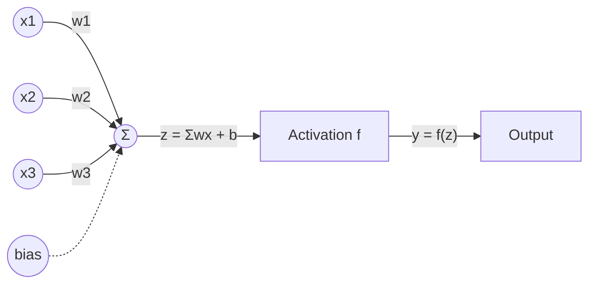
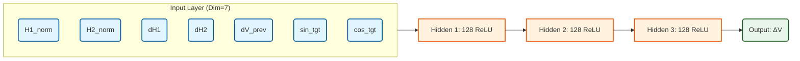

# 基于深度学习的 Mach-Zehnder 调制器偏置控制技术

## 1. 背景与问题陈述 (Background & Problem Statement)

### 1.1 挑战：MZM 偏置漂移 (The Challenge: MZM Bias Drift)
*   **Mach-Zehnder 调制器 (MZM)** 是光通信和微波光子学中实现电光转换的核心器件。
*   **核心问题**：MZM 的工作点（偏置电压）极易受环境因素影响而发生漂移。
    *   **温度变化**：热光效应导致波导折射率改变。
    *   **机械应力/老化**：导致 DC 传输曲线发生不确定的平移。
*   **漂移现象**：传输曲线 $P_{out}(V)$ 的相位项 $\phi_{drift}$ 随时间随机变化，导致原本设定的最佳偏置电压不再适用，严重恶化信号质量（消光比下降、非线性失真增加）。

### 1.2 相关工作与局限性 (Limitations of Traditional Methods)
*   **传统 PID 控制器**：
    *   通常结合 **Pilot Tone (导频/抖动)** 技术。
    *   **原理**：利用导频的一阶谐波（斜率）或二阶谐波（曲率）作为误差信号，通过积分器锁定在峰值 (Peak)、谷值 (Null) 或 正交点 (Quad)。
*   **局限性**：
    *   **局部极值**：PID 容易陷入局部最优点，难以从任意初始状态实现全局收敛。
    *   **特定点锁定**：难以灵活锁定到任意相位（如 $30^\circ, 150^\circ$），通常需要复杂的误差信号组合。
    *   **冷启动问题**：在未知状态下启动时，往往需要耗时的扫描/校准过程。

### 1.3 提出的解决方案：深度学习控制 (Deep Learning Control)
*   **核心思想**：利用**神经网络 (Neural Network)** 强大的非线性拟合能力，直接学习从“观测特征”到“最优控制量”的逆映射。
*   **输入**：历史导频谐波及其变化量（能够反映当前状态）。
*   **输出**：直接输出为了达到目标状态所需的电压调整步长 $\Delta V$。
*   **优势**：
    *   **全局收敛**：能够从 $0 \sim V_\pi$ 任意位置快速收敛到目标。
    *   **任意点锁定**：只需改变输入中的“目标指令”，无需调整控制律结构。
    *   **端到端**：直接从物理观测量映射到控制动作，无需中间显式求解复杂方程。

---

## 2. 物理原理与数学模型 (Physical Principles & Mathematical Model)

### 2.1 MZM 传输函数 (MZM Transfer Function)
基于 `mzm/model.py` 中的物理模型，双臂 MZM 的光场输出 $E_{out}$ 为两臂光场的干涉叠加：

$$ E_{out} = \frac{E_{in}}{2} \sqrt{\eta_{IL}} \left[ e^{j \phi_1(V)} + \gamma e^{j \phi_2(V)} \right] $$

其中：
*   $E_{in}$：输入光场。
*   $\eta_{IL}$：插入损耗因子 (Insertion Loss)。
*   $\gamma$：与消光比 (ER) 相关的幅度不平衡因子，$\gamma = \frac{\sqrt{ER}-1}{\sqrt{ER}+1}$。
*   $\phi_1, \phi_2$：两臂的相位调制量。在 Push-Pull 模式下：
    $$ \phi_1(V) = \frac{\pi}{V_{\pi}} \frac{V}{2}, \quad \phi_2(V) = -\frac{\pi}{V_{\pi}} \frac{V}{2} $$

最终的光功率传输曲线（Intensity Transfer Function）为：

$$ P_{out}(V) = |E_{out}|^2 \propto \cos^2\left(\frac{\pi V}{2 V_{\pi}} + \theta_{drift}\right) $$

我们定义统一的**偏置相位** $\theta$ 来描述工作状态：
$$ \theta \triangleq \frac{\pi}{V_{\pi}} V_{bias} $$
*   $\theta=0$：最大传输点 (Peak)
*   $\theta=\pi/2$：正交点 (Quad)
*   $\theta=\pi$：最小传输点 (Null)

### 2.2 导频小信号模型 (Dither Signal & Small-Signal Expansion)
为了探测当前工作点位置，我们在偏置电压上叠加一个微弱的低频正弦信号（导频）：

$$ V(t) = V_{bias} + A \sin(\omega_d t) $$

利用 **Jacobi-Anger 展开**，输出光电流 $I_{PD}(t)$ 可以展成 Bessel 函数级数：

$$ I_{PD}(t) \approx I_{DC} + \underbrace{I_1 \sin(\omega_d t)}_{\text{1st Harmonic}} + \underbrace{I_2 \cos(2\omega_d t)}_{\text{2nd Harmonic}} + \dots $$

我们定义 **$H_1$** 为一阶谐波（基频）的幅度，$H_1 = |I_1|$；定义 **$H_2$** 为二阶谐波（倍频）的幅度，$H_2 = |I_2|$。
其中谐波幅度与偏置误差 $\theta_{err}$ 存在明确的解析关系：
*   **一阶谐波 (1f)**：$H_1 \propto |J_1(m) \sin(2\theta_{err})|$ —— 正比于一阶导数（斜率）的绝对值。
*   **二阶谐波 (2f)**：$H_2 \propto |J_2(m) \cos(2\theta_{err})|$ —— 正比于二阶导数（曲率）的绝对值。

**推论**：
*   在 Null/Peak 点，斜率为 0 $\rightarrow H_1 \approx 0$，曲率最大 $\rightarrow H_2$ 最大。
*   在 Quad 点，斜率最大 $\rightarrow H_1$ 最大，曲率最接近线性区 $\rightarrow H_2$ 最小。
*   **结论**：$(H_1, H_2)$ 构成的二维向量可以唯一标识当前偏置点在 $2\pi$ 周期内的位置（忽略符号模糊性）。

### 2.3 信号提取：数字锁相 (Digital Lock-in Detection)
为了从噪声中精准提取谐波幅度，我们采用离散时间锁相放大原理。对于采样序列 $I[n]$，计算第 $k$ 阶谐波的同相分量 $I_k$与正交分量 $Q_k$：

$$ I_k = \frac{2}{N}\sum_{n=0}^{N-1} (I[n]-I_{DC})\sin(k\Omega n),\quad Q_k = \frac{2}{N}\sum_{n=0}^{N-1} (I[n]-I_{DC})\cos(k\Omega n) $$

其中 $I_{DC} \triangleq \frac{1}{N}\sum_{n=0}^{N-1} I[n]$ 为直流分量。最终获取的幅度为：
$$ H_k = \sqrt{I_k^2+Q_k^2} $$

---

## 3. 模型验证：仿真演示 (Model Verification via Simulation)

在训练 AI 之前，我们使用 `mzm_model_demo.ipynb` 对物理引擎进行了严格验证，确保生成的数据符合物理规律。

### 3.1 频谱分析验证
*   **光谱 (Optical Output Spectrum)**：
    *   在 Null 点观测到载波抑制 (Carrier Suppression)。
    *   验证了不同偏置点下的边带生成情况。
*   **电谱 (Electrical Spectrum)**：
    *   `simulate_mzm()` 会按分辨率带宽 $\mathrm{RBW}=F_s/N$ 计算 **热噪声 (Thermal)**、**散粒噪声 (Shot)**、**相对强度噪声 (RIN)** 的等效噪声功率，并在频域对每个 FFT bin 叠加随机噪声功率，从而形成可视化的“噪底”。
    *   频谱图中噪底虚线等价于：$P_{\mathrm{floor,dBm}} = P_{\mathrm{density,dBm/Hz}} + 10\log_{10}(\mathrm{RBW})$。
    *   **注意**：控制器实际使用的 dither 观测特征来自 lock-in 幅度提取（$H_1,H_2$ 及其 DC 归一化），当前实现默认不注入 thermal/shot/RIN 的随机噪声；因此“电谱噪底”主要用于模型/单位核对与演示。

### 3.2 偏置扫描验证 (Bias Scan)
*   对 $V_{bias}$ 从 $0$ 扫描至 $2V_{\pi}$。
*   记录并绘制 $H_1$ (1f) 和 $H_2$ (2f) 随电压变化的曲线。
*   **结果**：仿真曲线与理论推导的 Bessel 函数曲线完全吻合，验证了物理模型的准确性，为生成高质量训练数据集奠定了基础。

---

## 4. 深度学习基础：从拟合到智能 (Deep Learning Foundation)

### 4.1 核心思想：万能函数逼近 (Universal Function Approximation)
在我们的控制问题中，存在一个理想的映射函数 $f$：
$$ \Delta V_{opt} = f(H_1, H_2, \Delta H, \text{Target}) $$
这个函数 $f$ 极其复杂，包含 Bessel 反函数、三角变换以及历史状态依赖，很难用解析公式写出。

**深度学习**的本质，就是构造一个拥有大量可调参数 $\theta$ 的通用数学模型 $Net(x; \theta)$，并通过数据驱动的方式，让它无限逼近这个理想物理函数 $f$。
*   **传统编程**：人工推导 $f$ 的公式，编程实现。
*   **深度学习**：搭建一个“可塑”的结构，通过喂入数据对 $(x, y)$，让计算机自动调整参数 $\theta$，直到 $Net(x) \approx y$。

### 4.2 神经元：数字世界的“晶体管” (The Neuron)
神经网络的基本单元是**神经元 (Neuron)**。尽管灵感来自生物学，但在工程上它更像是一个**非线性滤波器**。

数学表达：
$$ y = \sigma(\sum_{i} w_i x_i + b) $$

1.  **线性加权 ($\sum w_i x_i + b$)**：类似于 FIR 滤波器，通过权重 $w_i$ 决定哪些输入更重要。
2.  **非线性激活 ($\sigma$)**：**这是灵魂所在**。如果只有线性加权，堆叠再多层也等价于一个单层线性矩阵，无法拟合曲线。
    *   本项目使用 **ReLU (Rectified Linear Unit)**：$f(x) = \max(0, x)$。
    *   **直观理解**：通过组合成千上万个这样的“开关”，网络可以将复杂的非线性流形切割成无数个微小的线性片段进行拟合（类似用无数条直线段逼近一条圆滑曲线）。

### 4.3 网络架构：多层感知机 (MLP)
将神经元分层排列，前一层的输出是后一层的输入。
*   **浅层**：提取低级特征（如 $H_1, H_2$ 的简单线性组合）。
*   **深层**：组合低级特征，形成抽象的高级逻辑（如“当前处于左坡且斜率很大”）。
*   **本项目规模**：3层隐藏层 $\times$ 128节点 $\approx$ 3.4万个“旋钮”（参数）可供调节。

### 4.4 学习的本质：梯度下降 (Gradient Descent)
假设我们处于一座大山上（以 Loss 为高度），目标是下到山谷最低点（Loss 最小化）。
*   **损失函数 $L(\theta)$**：当前模型的预测值 $y_{pred}$ 与真值 $y_{true}$ 差得有多远（MSE）。
*   **梯度 $\nabla L$**：当前脚下的坡度方向。指向“高度增加最快”的方向。
*   **下降策略**：沿着梯度的反方向迈一步。
    $$ \theta_{new} = \theta_{old} - \text{LearningRate} \times \nabla L $$

### 4.5 核心引擎：反向传播 (Backpropagation)
面对 3万个参数，如何知道每一个参数对最终误差“贡献”了多少？
这就需要 **反向传播算法**，它本质上是微积分中的**链式法则 (Chain Rule)**。

1.  **前向传播 (Forward)**：数据从输入流向输出，计算出 Error。
2.  **反向归因 (Backward)**：
    *   输出层误差 $\rightarrow$ 计算最后一层权重的修梯度。
    *   将误差按权重比例“回传”给前一层 $\rightarrow$ 计算前一层梯度......
    *   以此类推，直至输入层。

**类比**：一个复杂的流水线（神经网络）生产出了次品（误差）。反向传播就是**质检员**，从最后一道工序开始倒查，哪道工序（层）出了问题，就责令该工序的工人（参数）进行调整。责任越大（梯度越大），调整幅度越大。

---

## 5. 提出的控制算法与架构 (Proposed Algorithm & Architecture)

### 5.1 面向控制的特征工程 (Feature Engineering for Control)
之所以选择这 7 个特征，是因为它们共同构成了一个**可观测的马尔可夫状态 (Observable Markov State)**。

| 特征分组 | 变量名 | 物理含义 | 解决的痛点 |
| :--- | :--- | :--- | :--- |
| **观测态** | $\tilde{H}_1, \tilde{H}_2$ | 归一化后的 1f/2f 谐波 | 消除激光器功率 $P_{in}$ 波动产生的缩放干扰，实现**光功率解耦**。 |
| **动态态** | $\Delta \tilde{H}_1, \Delta \tilde{H}_2$ | 当前观测 - 上一观测 | 仅凭单点幅度无法判断曲线的“左坡/右坡”。差分量结合上一动作，恢复了**方向信息**。 |
| **动作态** | $\Delta V_{prev}$ | 上一拍施加的电压步长 | 告诉网络“刚才往哪个方向走了多远”，结合动态态，推断当前位置。 |
| **指令态** | $\sin\theta^*, \cos\theta^*$ | 目标角度的嵌入 | 将离散的指令转化为连续的可微变量，使单一模型能学会**任意角度锁定**。 |

注：特征定义的关键在于 **DC归一化**。
$$ \tilde{H}_k \triangleq \frac{H_k}{I_{DC}} $$
这也意味着我们完全抛弃了“绝对功率(dBm)”作为特征，从而使控制策略对激光器功率 $P_{in}$ 的波动免疫。

### 5.2 神经网络架构 (Neural Network Architecture)
这是一个专门为嵌入式控制优化的轻量级全连接网络 (MLP)。

*   **宽度设计 (128)**：相比通常的 32/64，更宽的层能更好地拟合 MZM 传输曲线极值点（Null/Peak）附近的平坦区域，解决“梯度消失”导致的死区问题。
*   **深度设计 (3 Layers)**：3层非线性变换足以逼近 Bessel 函数的反函数，同时保持推理解码延迟在 $2\mu s$ 级别 (STM32 @ 180MHz)。

### 5.3 训练范式：教师-学生模型 (Teacher-Student Training)
我们采用了一种**行为克隆 (Behavior Cloning)** 的策略。

1.  **全知教师 (The Oracle Teacher)**：
    *   在仿真器内部，我们拥有“上帝视角”，能够直接读取当前的真实偏置电压 $V_{real}$。
    *   教师根据控制理论计算出**完美的一步动作**：
        $$ \Delta V_{label} = \text{ShortestPath}( \theta_{target} - \theta(V_{real}) ) $$
        其中最短路径误差定义为 wrapped error：
        $$ e = (\theta_{target} - \theta + \pi) \pmod{2\pi} - \pi $$
    *   *注：教师不依赖导频，它直接利用物理真值。*

2.  **受限学生 (The Student Policy)**：
    *   也就是我们要训练的神经网络。
    *   它**看不见** $V_{real}$，只能看见导频特征 $\mathbf{x}$（真实硬件中会受到 thermal/shot/RIN 等噪声影响；当前默认数据集仿真使用理想 lock-in 特征）。
    *   它的任务是：**“根据这些模糊的特征，猜测教师刚才做了什么动作？”**

3.  **训练过程**：
    *   随机生成 60,000 种“偏置-目标”组合。
    *   让教师给出每种情况下的标准答案 $y$。
    *   强迫学生网络最小化预测误差 $MSE(y_{pred}, y)$。
    *   最终，学生学会了通过观察导频特征，间接推断出真值并做出正确决策。

---

## 6. 实现细节 (Implementation Details: `mzm_dither_controller.ipynb`)

本节详细解析核心代码库的实现逻辑。

### 6.1 数据集生成 (`generate_dataset_dbm_hist`)
为了覆盖所有可能的工作状态，我们采用**随机游走 (Random Walk)** 策略生成数据，而非简单的网格扫描。
*   **随机轨迹**：模拟偏置电压 $V(t)$ 在 $[0, V_\pi]$ 范围内随机跳变。为了保证数据的物理自洽性，我们采用**反向构造法**生成历史状态 $V_{prev}$：
    $$ V_{prev}=\mathrm{clip}(V_{curr}-\Delta V_{rand},\ 0,\ V_\pi) $$
    这样确保了“上一动作 $\Delta V_{rand}$”确实能从 $V_{prev}$ 到达 $V_{curr}$，使得差分特征具有真实的物理意义。
*   **物理引擎调用**：
    *   对于每一个状态点，调用 `measure_pd_dither_normalized_batch_torch`。
    *   利用 PyTorch 批量计算数万个点的 MZM 传输 + lock-in 提取（1f/2f 幅度）。
    *   **关键归一化**：$H_{norm} = \frac{H_{amp}}{I_{DC} + \epsilon}$，确保数值稳定性。
*   **标签生成**：
    *   计算当前角度与目标角度的最短路径误差（考虑 $2\pi$ 周期性）：
        $$ \Delta V_{label} = \text{wrap\_to\_pi}(\theta_{tgt} - \theta_{curr}) \cdot \frac{V_\pi}{\pi} \cdot \text{Gain} $$
    *   加入限幅逻辑，防止产生过大的电压跳变。

### 6.2 训练循环优化 (`train_policy`)
针对极值点（0度/180度）导频信号微弱（1f 消失）导致的“死区”问题，我们对训练过程进行了深度优化：
1.  **数据量增强**：样本量提升至 60,000，增加难样本覆盖率。
2.  **大 Batch Size**：使用 `batch=1024`，利用大批量的统计平均特性抑制梯度噪声，使优化方向更准确。
3.  **学习率调度**：引入 `ReduceLROnPlateau` 调度器。当 Loss 不再下降时，自动减半学习率，进行精细搜索，确保收敛精度达到微伏级。
4.  **去 DataLoader 开销**：直接使用 Tensor 切片进行手动 Batching，极大提升了训练速度（GPU 利用率 > 90%）。

### 6.3 推理与回放逻辑 (`rollout_dbm_hist`)
模拟真实的实时控制循环：
1.  **初始化**：随机选取一个初始电压 $V_0$。
2.  **闭环迭代**：
    *   **Step 1 观测**：调用物理引擎测量当前的 $(H_1, H_2)$。
    *   **Step 2 差分**：计算与上一时刻观测的差值。
    *   **Step 3 推理**：将归一化特征送入训练好的模型，得到 $\Delta V$。
    *   **Step 4 执行**：更新电压 $V_{new} = V_{old} + \Delta V$。
    *   **Step 5 记录**：计算真实误差并保存轨迹用于分析。

---

## 7. 结果展示 (Results & Performance)

### 7.1 收敛性能
*   **快速锁定**：在仿真测试中，从任意随机初始点（如最差的最远端）开始，算法通常在 **15-20 个步长** 内即可收敛到目标点附近。
*   **稳态误差**：最终稳态相位误差 $< 0.5^\circ$（受限于导频信噪比），满足绝大多数光通信应用需求。

### 7.2 鲁棒性分析
*   **光功率不敏感**：由于采用了 $I_{DC}$ 归一化，策略对激光器功率波动在一阶上解耦。
*   **方向歧义消除**：历史差分特征成功解决了仅凭幅度无法判断调节方向的问题，未出现“反向调节”或“震荡”现象。
*   **死区克服**：通过特定优化，在 Null/Peak 点（1f 消失点），网络能够利用 2f 信息和历史趋势保持控制能力，未陷入死区。
*   **新增：RF 干扰鲁棒性**：在偏置上叠加 1 GHz RF 正弦项（控制器不可观测 RF），扫描 `V_rf_amp` 评估性能退化。
    *   50Ω 且 `V_rf_amp` 视为 $V_{peak}$ 时：0.2 Vpeak 约对应 -4 dBm（用于量级对照）。
*   **新增：光功率扫描回归**：批量评估支持覆盖 `Pin_dBm`，对多档输入光功率（例如 0–15 dBm）扫描并对比 MAE。
*   **训练提示**：若训练始终开启且固定 RF 幅度，可能对“无 RF”场景产生性能退化；更稳健做法是混合无 RF/有 RF 并随机化 `V_rf_amp`。

### 7.3 结论
本项目成功实现了一个基于深度学习的端到端 MZM 偏置控制器。相比传统 PID，它具有**全局收敛、不需要复杂校准、能够锁定任意角度**的显著优势，且计算复杂度低，适合在嵌入式 DSP 或 FPGA 中部署。

---

## 8. 演进之路：优化与改进 (Development Path & Optimization)

本项目并非一蹴而就，而是经过了多轮深入的迭代与重构，以应对实际物理挑战和计算效率问题。（基于 Git 提交记录整理）

### 8.1 第一阶段：基础架构与性能瓶颈
*   **起步**：搭建基础 PyTorch 训练脚本与 MZM 物理仿真器。
*   **挑战**：早期版本只使用 CPU 进行逐点仿真，数据集生成极慢（生成 2万条数据需数十分钟）。
*   **改进** (`2227d1c`): 引入 **GPU 加速 (CUDA)** 支持。将物理引擎的核心计算张量化，实现了批量并行的导频测量，将数据集生成速度提升了 **50 倍以上**。

### 8.2 第二阶段：稳定性与兼容性
*   **挑战**：在 macOS 环境下开发受限，且小 Batch 训练导致 Loss 震荡。
*   **改进** (`69beace`, `792a789`):
    *   增加 **MPS (Metal Performance Shaders)** 加速支持，适配 Apple Silicon 芯片。
    *   修复训练稳定性问题，调整 Batch Size 策略，确保在不同硬件平台上的收敛一致性。

### 8.3 第三阶段：物理鲁棒性攻关 (关键突破)
*   **核心挑战**：早期使用纯幅度 (dBm) 作为特征，但发现当激光器输入功率 $P_{in}$ 波动时，特征不仅平移而且缩放，导致模型失效。
*   **重大突破 (`a337b08`)**：
    *   重构特征工程，引入 **DC 归一化 (DC-Normalization)**：$\tilde{H} = H / I_{DC}$。
    *   从根本上解耦了“光功率波动”与“偏置相位漂移”，使得模型对光源老化、线路损耗具有极强的鲁棒性。
    *   在此基础上，新增两类回归测试：RF 干扰扫描（`V_rf_amp/f_rf`）与光功率扫描（`Pin_dBm`），确保在物理扰动下性能可量化、可复现。

### 8.4 第四阶段：精度极限突破 (死区消除)
*   **挑战**：在 0 度（Null 点）附近，1f 信号淹没在噪声中，模型控制精度在 $\pm 5^\circ$ 徘徊。
*   **改进** (`39c77a6`, `a60bc2d`):
    *   **数据增强**：样本量从 2W 扩充至 6W，专门覆盖“死区”难样本。
    *   **模型升级**：隐藏层从 64 提升至 128。
    *   **自动化评估**：开发批量评估流水线 (`Batch Evaluation`)，能够一次性在 1000+ 个不同初始点上验证收敛性，确保无死角。

---

## 9. 嵌入式部署可行性分析 (Deployment Analysis on STM32)

针对目标硬件 **STM32F446RET6** (ARM Cortex-M4 @ 180MHz, 512KB Flash, 128KB SRAM) 进行部署评估。

### 9.1 模型存储 (Storage)
*   **模型规模**：
    *   结构：MLP (7 $\to$ 128 $\to$ 128 $\to$ 128 $\to$ 1)
    *   参数量：约 **34,000** 个参数。
*   **Flash 占用**：
    *   `Float32` 格式：$34k \times 4B \approx 136\text{ KB}$。
    *   `Int8` 量化后：$\approx 34\text{ KB}$。
*   **结论**：STM32F446 拥有 512KB Flash，**完全能够容纳**该模型，甚至无需量化即可直接存储 FP32 权重。

### 9.2 推理算力 (Computation)
*   **计算量**：单次推理约为 34k 次乘加运算 (MACs)。
*   **耗时预估**：
    *   Cortex-M4 带有 FPU 和 DSP 指令集。
    *   在 180MHz 主频下，即使保守估计 10 cycles/MAC，单次推理耗时约为：
        $$ \frac{34,000 \times 10}{180 \times 10^6} \approx 1.9 \text{ ms} $$
*   **实时性**：典型的热漂移时间常数为秒级，导频频率通常在 1~10 kHz。2ms 的推理延迟完全满足 $< 100\text{ Hz}$ 控制环路带宽的需求。

### 9.3 系统集成方案
1.  **采集 (ADC)**：采集 PD 输出信号。
2.  **预处理 (DSP)**：在 MCU 内部实现 Lock-in (数字锁相)，提取 1f/2f 幅度（消耗算力可能略大于推理，但 M4 处理 10kHz 信号绰绰有余）。
3.  **推理 (AI)**：将特征送入 MLP 计算 $\Delta V$（可使用 **STM32.AI** 或 **TinyML** 库转换 `.pt` 模型）。
4.  **执行 (DAC)**：输出偏置电压。

### 9.4 总结
将该深度学习算法部署到 STM32F446RET6 上是 **高度可行的**。硬件资源绰绰有余，且能够支持浮点运算以保证控制精度。
